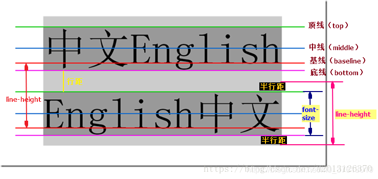

# CSS

## 选择器

```css
<div class="father" id="father">
	<div class="son">
		<div class="grand-son">

		</div>
	</div>

	<div class="son">
	</div>

  <div class="son">
	</div>
</div>

//第一种：类选择器
.father{}

//第二种：id选择器
#father{}

//第三种：标签选择器
div{}

//第四种：群组选择器
#father,.son,div{}

//第五种：后代选择器
.father div{}

//第六种：子代选择器,选择所以子元素，而非所有后代元素
.father>div{}

//第七种：兄弟选择器:会选择所有兄弟元素
.son~div{}

//第八种：相邻兄弟选择器:会选择到下面兄弟元素
.son+div{}

//第九种：结构伪类选择器
:first-child    第一个子元素
:last-child     最后一个子元素
:nth-child(n)    选中第n个元素
:first-of-type  相同元素中第一个子元素
:last-of-type   相同元素中最后一个子元素
:nth-of-type(n)  相同元素中选中第n个元素
n的取值
1.n：       选择第n个元素
2.odd/2n+1：选择序号为奇数的元素
3.even/2n： 选择序号为偶数的元素
4.an+b：a：周期长度，b：偏移量，n：从0开始的计数器（0, 1, 2, 3...）

//第十种：动态伪类选择器
:link 超链接未被访问的状态
:visited 超链接访问过的状态
:hover 鼠标悬停在元素上的状态
:active 元素激活的状态（鼠标按下不松开）
:focus 获取焦点的元素

//第十一种：否定伪类
:not(选择器)：排除满足括号中条件的元素

//第十二种：ui伪类
:checked  被选中的复选框或单选按钮
:enable   可用的表单元素（没有 disabled 属性）
:disabled 不可用的表单元素（有 disabled 属性）

//第十三种：伪元素选择器：选中元素中的一些特殊位置
::first-letter 选中元素中的第一个文字
::first-line 选中元素中的第一行文字
::selection 选中被鼠标选中的内容
::placeholder 选中输入框的提示文字
::before 在元素最开始的位置，创建一个子元素（必须用 content 属性指定内容）
::after 在元素最后的位置，创建一个子元素（必须用 content 属性指定内容

```

## 字体属性 font

| 属性        | 含义       | 取值                                                         |
| ----------- | ---------- | :----------------------------------------------------------- |
| font-size   | 大小、尺寸 | inherited:继承默认从父标签继承字体大小，所有CSS属性的默认值都是inherited<br/>px:像素<br/>%:相对父标签字体大小的百分比<br/>em:相对于父标签字体大小的倍数 |
| font-weight |            | normal:普通（默认）<br/>bold:粗体<br/>数字                   |
| font-family | 字体       | 一般建议写3种字体：首选,其次,备用。以逗号隔开                |
| font-style  |            | normal:普通(默认)<br/>italic:斜体                            |
| font        | 简写       | font:font-style font-weight font-size font-family            |

## 文本属性

| 属性            | 含义           | 取值                                                         |
| --------------- | -------------- | ------------------------------------------------------------ |
| color           | 颜色           | 颜色名称：使用英文单词<br/>16进制的RGB值：#RRGGBB<br/>rgb函数：rgb(red,green,blue)<br/>rgba函数：rbga(red,green,blue,alpha)<br/>可以设置透明度，alpha取值范围：[0,1] 0表示完全透明 1表示完全不透明 |
| text-align      | 水平对齐方式   | left(默认)、center、right                                    |
| text-indent     | 首行缩进       | px:像素<br/>em：缩进标签字体个数                             |
| text-decoration | 文本修饰       | underline:下划线<br/>overline:上划线<br/>line-through:删除线 |
| text-transform  | 字母大小写转换 | lowercase、uppercase、capitalize(首字母大写)                 |
| letter-spacing  | 字符间距       | px:像素<br/>em：间距为标签字体个数                           |
| word-spacing    | 单词间距       | 只对英文有效                                                 |

## 元素类型

### block：块级元素

```js
//常见块级元素
<div>、<h1>~<h6>、<p>、<ul>、<ol>、<li>等
//特点
1.独占一行，宽度自动填满其父元素宽度。
2.可以设置width,height属性。块级元素即使设置了宽度,仍然是独占一行。
3.可以设置margin和padding属性。
```

### inline-block:行内块元素

```js
//常见行内块类型
、<input/>、<td>
//行内块元素特点：
1.相邻的行内元素在一行上，一行可以有多个行内元素，但之间有空隙
2.默认的宽度为内容决定；可以设置宽高，会覆盖默认的宽度；
3.各个方向的margin和padding都有效
```

### inline行内元素

```js
//常见行内元素
<a>、<strong>、<b>、<em>、<i>、<del>、<s>、<span>
//行内元素的特点
1.inline元素不会独占一行，多个相邻的行内元素会排列在同一行里，直到一行排列不下，才会新换一行，其宽度随元素的内容而变化。
2.inline元素设置width,height属性无效。
3.水平方向的padding，margin有效都产生边距效果；但竖直方向的padding，marign无效
```

## 背景属性

| 属性                  | 含义               | 取值                                                         |
| --------------------- | ------------------ | :----------------------------------------------------------- |
| background-color      | 背景颜色           | 颜色名称：使用英文单词<br/>16进制的RGB值：#RRGGBB<br/>rgb函数：rgb(red,green,blue)<br/>rgba函数：rbga(red,green,blue,alpha)<br/>默认值为transparent |
| background-image      | 背景图片           | none:无背景图（默认的）<br/>url("文件路径")<br/>渐变背景颜色：linear-gradient(to right,#333399,#ff00cc,..);<br/>渐变方向<br/>to top : 从下向上填充渐变色<br/>to right:从左向右填充渐变色<br/>to bottom:从上向下填充渐变<br/>to left  :从右向左填充渐变色 |
| background-repeat     | 背景图片的重复方式 | repeat(默认):平铺<br/>repeat-x：水平方向平铺<br/>repeat-y：垂直方向平铺<br/>no-repeat：不平铺 |
| background-position   | 背景图片的显示位置 | 关键字：top、bottom、left、right、center<br/>坐标：左上角为(0,0)坐标，向右为x正方向,向下为y正方向<br/>可以只写一个关键字，另一个关键字默认为center |
| background-size       | 背景图大小         | cover：时高度和宽度等比例拉伸，以使背景图像完全覆盖背景区域。背景图像的某些部分也许无法显示在背景定位区域中。<br/>contain：高度和宽度等比例拉伸，当宽度 或者 高度 铺满div盒子就不再进行拉伸了，可能有部分空白区域。<br/>百分比：50% 50%<br/>数字：100px 100px |
| background-attachment | 背景附着           | scroll（背景滚动） / fixed（背景固定）                       |
| background            | 简写               | 以空格隔开，书写顺序没有要求                                 |

## 阴影

### 盒子阴影：box-shadow

  box-shadow:offset-x offset-y blur spread color inset;

| c             | 取值 | 说明                                          |
| ------------- | ---- | --------------------------------------------- |
| offset-x      | px   | 水平方向阴影位置                              |
| offset-y      | px   | 垂直方向阴影位置                              |
| blur-radius   | px   | 阴影模糊程度                                  |
| spread-radius | px   | 阴影面积                                      |
| color         |      |                                               |
| inset         |      | 默认阴影在边框外。使用 inset 后，阴影在边框内 |

### 文字阴影：text-shadow

| text-shadow | 取值 | 说明             |
| ----------- | ---- | ---------------- |
| h-shadow    | px   | 水平方向阴影位置 |
| v-shadow    | px   | 垂直方向阴影位置 |
| blur        | px   | 阴影模糊程度     |
| color       |      | 阴影颜色         |

## 盒子模型

 	一个盒子由外到内可以分成四个部分：margin（外边距）、border（边框）、padding（内边距）、content（内容）。会发现margin、border、padding是CSS属性，因此可以通过这三个属性来控制盒子的这三个部分。而content则是HTML元素的内容

### 块级盒子类型

```js
//content-box
给content-box设置宽高实际上是设置content的宽高，content-box的实际宽高=content+marign+padding+border
//border-box
给border-box设置宽高实际上是设置盒子整体宽高，border-box的实际宽度=weight；高度=height
//设置盒子类型
box-sizing：
1.content-box(默认值)
2.border-box
```

### margin

```js
//设置margin
1.margin属性后跟两个值，第一个值设置上下边距，第二个是设置左右边距
2.margin属性后跟三个值，第一个值设置上边距，第二个是设置左右边距，第三个值设置下边距
3.margin属性后跟四个值，第一个值设置上边距，第二个是设置右边距，第三个值设置下边距，第四个值设置左边距

//marign合并
两个同级元素，垂直排列。上面的盒子给了margin-bottom，下面的盒子给了margin-top。那么这两个边距将会重叠，按照大的值来计算。

//marign塌陷
两个父子元素，内部的子盒子给了margin-top，父元素也会受到影响，同时产生上边距

//解决margin塌陷
1.给父元素设置border
2.给父元素设置overflow：hidden
3.给父元素设定padding值 
4.给父元素添加position：fixed 

//为什么overflow：hidden能解决塌陷
为父元素添加 overflow: hidden 能解决 margin 塌陷问题，原因在于这个属性会触发 BFC，具有BFC特性的元素可以看作是隔离的独立容器，容器里面的元素不会在布局上影响到外面的元素
```

### border

```js
//1.圆角
border-top-left-radius：左上角
border-top-right-radius：右上角
border-bottom-left-radius：左下角
border-bottom-right-radius：右下角
//2.常见应用
1.圆形
border-radius:宽高的一半px/50%
2.胶囊形
border-radius:盒子高度的一半
```

### 盒子阴影：box-shadow

  box-shadow:offset-x offset-y blur spread color inset;

| 属性          | 取值 | 说明                                          |
| ------------- | ---- | --------------------------------------------- |
| offset-x      | px   | 阴影位置                                      |
| offset-y      | px   |                                               |
| spread-radius | px   | 阴影面积                                      |
| blur-radius   | px   | 阴影模糊程度                                  |
| color         |      |                                               |
| inset         |      | 默认阴影在边框外。使用 inset 后，阴影在边框内 |

## 溢出

```js
//元素溢出：overflow
取值：
hidden:隐藏溢出
scroll：设置滚动条(有没有溢出都会显示)
auto:当一溢出时设置滚动条
//文字溢出：text-overflow
1.单行文字溢出
 white-space: nowrap;//（ 默认 normal 自动换行）先强制一行内显示文本
 overflow: hidden;//超出的部分隐藏
 text-overflow: ellipsis;//文字用省略号替代超出的部分
```

## line-height 

​	line-height只作用于inline-block，iinline元素，line-height=上下半行距+font-size



## vertical-align

```js
//line-box
定义：Line Box 是包含一行内所有行内元素的矩形区域
生成：在块级容器中，文本内容会自动生成 Line Box
高度计算：由该行内所有行内元素中最高元素的 height、line-height、vertical-align 等属性共同决定
//baseline
1.文本的baseline是字母x的下方
2.Inline-block默认的baseline是margin-bottom的底部（没有margin-bottom，就是盒子的底部）
3.Inline-block有文本时，baseline是最后一行文本的x的下方
//verticle-align取值
1.baseline(默认值)：基线对齐
2.top：把行内级盒子的顶部跟line box顶部对齐
3.middle：行内级盒子的中心点与父盒基线加上x-height一半的线对齐
4.bottom：把行内级盒子的底部跟line box底部对齐
//幽灵空白问题解决
1.方案一：调整垂直对齐
设置vertical-align为middle、bottom或top，而不是默认的baseline，可以消除下方的空白
2.方案二：将inline-block的display设置为block

```

## 定位：position

```css
1.relative
它是相对于自己原来的位置来移动的,不脱离文档流
2.absolute
如果没有祖先元素或者祖先元素没有定位，则以浏览器为准定位
如果祖先元素有定位（相对、绝对、固定定位），则以最近一级的有定位祖先元素为参考点移动位置
3.fixed
以浏览器的可视窗口为参照点移动元素。跟父元素没有任何关系，不随滚动条滚动。
固定定位不在占有原先的位置。
4.定位叠放次序 z-index
在使用定位布局时，可能会出现盒子重叠的情况。此时，可以使用 z-index 来控制盒子的前后次序 (z轴)
z-index只对有定位或者父元素display为flex/grid时有效
```

## visibility

```js
//visibility 属性用于指定一个元素应可见还是隐藏。
1.visible ; 元素可视
2.hidden; 元素隐藏
visibility 隐藏元素后，继续占有原来的位置。
如果隐藏元素想要原来位置， 就用 visibility：hidden
如果隐藏元素不想要原来位置， 就用 display：none (用处更多 重点）

```

## css布局

### 弹性布局

```js
//justify-content:水平对齐方式
flex-start（默认值）：左对齐
flex-end：右对齐
center： 居中
space-between：两端对齐
space-around：每个项目两侧的间隔相等。项目之间的间隔比项目与边框的间隔大一倍
space-evenly：项目之间的间隔比项目与边框的间隔一样
//aligin-item:垂直对齐方式
stretch（默认值）：如果项目未设置高度或设为auto，将占满整个容器的高度。
flex-start：顶点对齐
flex-end：底部对齐
center：中心对齐
baseline：基线对齐
//align-content：多根轴线的对齐方式。如果项目只有一根轴线，该属性不起作用
flex-start（默认值）：顶点对齐
flex-end：底部对齐
center： 中心对齐
space-between：两端对齐
space-around：每个项目两侧的间隔相等。项目之间的间隔比项目与边框的间隔大一倍
space-evenly：项目之间的间隔比项目与边框的间隔一样
//align-self
align-self属性允许单个项目有与其他项目不一样的对齐方式，可覆盖align-items属性
//flex-direction：决定主轴的方向
row：默认
column：主轴为垂直方向
//flex-wrap：元素超出容器，是否换行
nowrap（默认）：不换行
wrap：换行
//flex：元素尺寸
数字：表示占用父级剩余尺寸的份额
//flex-glow：设置元素的放大比例
默认为0，即如果存在剩余空间，也不放大
如果所有项目的flex-grow属性值都为1，则它们将等分剩余空间（如果有的话）
如果一个项目的flex-grow属性值为2，其他项目都为1，则前者占据的剩余空间将比其他项多一倍
//flex-shrink：设置元素的缩小
默认为1，即如果空间不足，该项目将缩小。
如果为0，空间不足时不缩小
```

### 网格布局

```js
//dispaly
我们通过在元素上声明 display：grid 或 display：inline-grid 来创建一个网格容器。声明 display：grid 则该容器是一个块级元素，设置成 display: inline-grid 则容器元素为行内元素
//grid-template-columns：定义列数和容器内元素宽度
1.grid-template-columns: 1fr 1fr：一行分为两列
2.grid-template-columns: 1fr 200px 1fr：中间固定200px，两边自动平均分配
//grid-template-rows：定义行数和容器内元素高度

//repeat()函数
如果多列的元素宽度相同，可以使用repeat()函数，grid-template-columns: repeat(5,1fr)

//auto-fill 关键字
表示自动填充，让一行（或者一列）中尽可能的容纳更多的单元格
grid-template-columns: repeat(auto-fill,100px)

//minmax() 函数
定义网格元素一个最小和最大的尺寸
grid-template-columns: 1fr 1fr minmax(300px, 2fr) 的意思是，第三个列宽最少也是要 300px，但是最大不能大于第一第二列宽的两倍

//auto 关键字
通过 auto 关键字，我们可以轻易实现三列或者两列布局。grid-template-columns: 100px auto 100px 表示第一第三列为 100px，中间由浏览器决定长度

//grid-row-gap 属性、grid-column-gap 
分别设置行间距和列间距。grid-gap 属性是两者的简写形式。

// grid-auto-flow 
指定在网格中的元素怎样排列。默认的放置顺序是"先行后列"，即先填满第一行，再开始放入第二行，默认值是 row。
grid-auto-flow: row dense //表示尽可能填满表格。

//grid-auto-columns 和 grid-auto-rows 属性
1.显式网格:grid-template-columns 和 grid-template-rows 属性中定义的行和列
2.隐式网格：如果你在网格定义之外又放了一些东西，或者因为内容的数量而需要的更多网格轨道的时候，网格将会在隐式网格中创建行和列。
3.假如有多余的网格，那么它的行高和列宽可以根据 grid-auto-columns 属性和 grid-auto-rows 属性设置

//grid-col和grid-row
合并网格
```

## transform

```css
#1.translate:改变元素位置,当下x,y为百分比时,参照对象为自身
1.translate(x,y)
2.translateX(x)
3.translateY(y)
4.translateZ(z):按z轴位移,因为z轴是朝向我们的，所以看不出效果
5.translate3d(x,y,z)

#2.rotate:元素旋转
1.rotate(deg)：2d旋转,可以通过transform-origin设置旋转点,默认为元素中心
               transform-origin: x-axis y-axis z-axis
               transform-origin属性值可以是百分比、em、px等具体的值，也可以是top、right、bottom、left                和center这样的关键词。
2.rotateX(deg)
3.rotateY(deg)
4.rotateZ(deg)
4.rotate3D(x,y,z)

#3.scale
1.scale(x,y)      定义2D的缩放转换,实时上是缩放x轴y轴的刻度
2.scaleX(x)    通过设置 x 轴的值来定义缩放转换
3.scaleY(y)    通过设置 y 轴的值来定义缩放转换
4.scaleZ(z)    通过设置 z 轴的值来定义缩放转换
5.scale3d(x,y,z)   定义3D的缩放转换

#4.perspective：视距
定义观察者与屏幕的距离，添加给父级，取值范围800-1200px

#5.transform-style
设置子元素是位于3d空间还是2d平面
flat
preserve-3d
```

## transition

```css
#transition-property:设置元素中参与过渡的属性
none | all | property
#transition-duration:设置过渡需要花费的时间（单位为秒或者毫秒)对scale无效
s or ms
#transition-timing-function：设置过渡动画的类型
ease(默认）：慢快慢
linear：表示过渡效果以匀速进行
ease-in：慢快
ease-out：快慢
#transition-delay：设置过渡效果开始之前需要等待的时间
s or ms
#ransition：简写，可以设置多组过渡效果，每组之间使用逗号进行分隔
transition: transition-property transition-duration transition-timing-function transition-delay;
```

## animation

```css
/*动画的属性*/
#animation-name：设置需要绑定到元素的动画名称
#animation-duration：设置完成动画所需要花费的时间
s or ms
#animation-timing-function
ease(默认）：慢快慢
linear：表示过渡效果以匀速进行
ease-in：慢快
ease-out：快慢
#animation-fill-mode:置当动画结束时的状态
forwards	保持动画最后一个关键帧中的样式
backwards	保持动画第一个关键帧中的样式
#animation-delay：设置动画开始之前的延迟时间
#animation-iteration-count：设置动画被播放的次数
n：使用具体数值定义动画播放的次数，默认值为 1
infinite：无数次
#animation-direction：设置是否在下一周期逆向播放动画
normal	否（默认）
reverse	是
#animation-play-state：设置动画是正在运行还是暂停，默认是 running；
paused	暂停动画的播放
running	正常播放动画
/*定义动画*/
@keyframes animationName {
    0% {
        properties: value;
    }
    percentage {
        properties: value;
    }
    100% {
        properties: value;
    }
}
animationName：表示动画的名称；
from：定义动画的开头，相当于 0%；
percentage：定义动画的各个阶段，为百分比值，可以添加多个；
to：定义动画的结尾，相当于 100%；
properties：不同的样式属性名称，例如 color、left、width 等等。
```


## CSS规范

### 书写顺序

```css
1.位置属性(position, top, right,z-index, display, float等)
2.大小(width, height, padding,margin)
3.文字系列(font, line-height,letter-spacing, color， text-align等)
4.背景(background, border等)
5.其他(animation, transition等)
```

### 命名规范

```css
登录条：loginbar
标志：logo
侧栏：sidebar
广告：banner
导航：nav
子导航：subnav
菜单：menu
子菜单：submenu
搜索：search
滚动：scroll
页面主体：main
内容：content
标签页：tab
文章列表：list
提示信息：msg
小技巧：tips
栏目标题：title
加入：joinus
指南：guild
服务：service
热点：hot
新闻：news
下载：download
注册：regsiter
状态：status
按钮：btn
投票：vote
合作伙伴：partner
友情链接：friendlink
页脚：footer
版权：copyright
外　套：　　wrap
主导航：　　mainnav
子导航：　　subnav
页　脚：　　footer
整个页面：　content
页　眉：　　header
页　脚：　　footer
商　标：　　label
标　题：　　title
主导航：　　mainbav（globalnav）
顶导航：　　topnav
边导航：　　sidebar
左导航：　　leftsidebar
右导航：　　rightsidebar
旗　志：　　logo
标　语：　　banner
菜单内容1： menu1content
菜单容量：　menucontainer
子菜单：　　submenu
边导航图标：sidebarIcon
注释：　　　note
面包屑：　　breadcrumb(即页面所处位置导航提示）
容器：　　　container
内容：　　　content
搜索：　　　search
登陆：　　　Login
功能区：　　shop(如购物车，收银台)
当前的　　　current[/quote]
```


